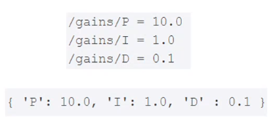

<h1 align="center"> Robótica Aplicada</h1>
<p>Disciplina optativa Robótica Aplicada ministrada pelo professor Vinícius no CEFET-MG campus de Leopoldina.</p>

- **ROSCORE**
    - É o core do framework, gerencia e distribui cada porta para cada tópico e conecta os publish e subscribers nos seus respectivos tópicos.
- **O que é um nó?**
    - O nó é um processo que roda no computador e que é executado através de um arquivo executável no computador.
- **Servidor de Parâmetros**
    - É um dicionário de valores compartilhado e acessível a todos os nós
    - São incializados junto com o Master
    - Nós podem usar o servidor para ler ou definir parâmetros de configuração durante sua operação
    - Existem dois tipos:
        - Parâmetros públicos: podem ser acessados diretamente sem especificar a qual nó pertencem:
        **/public_param**
        - Parâmetro privado: pertencem a um nó e são acessados especificando o nome desse nó primeiro:
        **/node_name/private_param**
            
            
            
- **Comunicação por tópicos** (**Publish e Subscriber):**
    - Quando um nó se inscreve em um tópico é porquê ele é um subscriber daquele tópico, então tudo que chegar naquele tópico ele vai receber de forma assincrona.
    - Quando um nó publica em um tópico é porquê ele é um publish daquele tópico, então ele publica dados no tópico de forma assincrona para que todos subscribers daquele tópico recebam esses dados.
        
        
        
- **Comunicação por Serviços (request e response)**
    - Comunicação síncrona e bidirecional.
    - Mensagens com tipos pré-definidos
    - Cada nó que seja oferecer um serviço deve implementar seu próprio servidor de serviço.
    - Serviços podem ser chamados da CLI ou por outros nós (cliente do serviço)
        
        
        
- **Comunicação do tipo Ação**
    - Usadas para pedidos que demoram para ter retorno
    Ex: Robô, pegue o grampeador
    - Assíncrona e bidirecional, implementação próxima a serviços.
    - Servidor e cliente de ação (incomum ser usado pelo CLI)
        
        
        
- **Pacotes no ROS (packages)**
    - É uma unidade básica de software do ROS
    - Pode conter nós, bibliotecas, arquivos de configuração, etc. **Mas sempre relacionados a uma funcionalidade específica.**
    - Sempre que possível, devem ser construídos de forma genérica, possibilitando o reuso de código (comunidade).
    - Podem ser instalados através de apt ou baixados pelo Github e compilados.
    - Pacotes podem ser pesquisados em:
        - [https://index.ros.org/](https://index.ros.org/)
        - [http://wiki.ros.org/Packages#:~:text=A ROS package is simply,and the unit of release](http://wiki.ros.org/Packages#:~:text=A%20ROS%20package%20is%20simply,and%20the%20unit%20of%20release).
- **Launch File**
    - São arquivos XML para automatizar o serviço de encanamento:
        - Inicializar grafos de nós, definir parâmetros, remapear tópicos.
        - Mestre inicializado automaticamente.
        - OBS: São muito importantes, sempre deve ser gasto tempo aqui
            - [http://wiki.ros.org/roslaunch](http://wiki.ros.org/roslaunch)
- **Bag**
    - É uma estrutura de datalog do ROS, ou seja, uma estrutura para salvar dados.
    - Formato de arquivos utilizado para salvar mensagens geradas durante uma sessão do ROS
    - Também permite o playback das informações em tempo controlado
    - Muito importante para análise de eventos (robótica é caro)
    - Pode gerar arquivos pesados e escrita intensiva no HD
        - [http://wiki.ros.org/rosbag](http://wiki.ros.org/rosbag)
- **Ferramentas**
    - **rosnode**
        - Serve para listar os nós, testar, ver informações, interromper, entre outras funcionalidade:
            
            ```bash
            **❯ rosnode --help**        
            rosnode is a command-line tool for printing information about ROS Nodes.
            
            Commands:
            	rosnode ping	test connectivity to node
            	rosnode list	list active nodes
            	rosnode info	print information about node
            	rosnode machine	list nodes running on a particular machine or list machines
            	rosnode kill	kill a running node
            	rosnode cleanup	purge registration information of unreachable nodes
            
            Type rosnode <command> -h for more detailed usage, e.g. 'rosnode ping -h'
            ```
            
    - **rosrun**
        - Para não precisar caminhar até cada uma das pastas e executar o arquivo executável que roda um nó existe a ferramenta **rosrun,** que é uma ferramenta CLI que facilita a execução de um nó através do comando abaixo:
            
            ```bash
            **rosrun --help**
            rosrun [--prefix cmd] [--debug] PACKAGE EXECUTABLE [ARGS]
            rosrun will locate PACKAGE and try to find an executable named EXECUTABLE in the PACKAGE tree.
            If it finds it, it will run it with ARGS.
            ```
            
        - Na hora de executar um nó de pacote com o **rosrun** você pode **alterar o nome de um tópico** com a sintaxe abaixo:
            
            ```bash
            rosrun [--prefix cmd] [--debug] PACKAGE EXECUTABLE **/topic1:=/topic2**
            ```
            
        - Também é possível **criar um parâmetro no nó** na hora de rodar um nó com **rosrun:**
            
            ```bash
            rosrun [--prefix cmd] [--debug] PACKAGE EXECUTABLE **_param_name:=7**
            ```
            
        - Também é possível setar **parâmetros especiais**, como o parâmetro que **muda o próprio nome do nó**:
            
            ```bash
            rosrun [--prefix cmd] [--debug] PACKAGE EXECUTABLE __**name:=nome_do_no**
            ```
            
    - **rostopic**
        - Serve para interagir com os tópicos
            
            ```bash
            **rostopic --help**          
            rostopic is a command-line tool for printing information about ROS Topics.
            
            Commands:
            	rostopic bw	display bandwidth used by topic
            	rostopic delay	display delay of topic from timestamp in header
            	rostopic echo	print messages to screen
            	rostopic find	find topics by type
            	rostopic hz	display publishing rate of topic    
            	rostopic info	print information about active topic
            	rostopic list	list active topics
            	rostopic pub	publish data to topic
            	rostopic type	print topic or field type
            
            Type rostopic <command> -h for more detailed usage, e.g. 'rostopic echo -h'
            ```
            
    - **rosparam**
        - Serve para ler e setar parâmetros.
            
            ```bash
            **rosparam --help**
            rosparam is a command-line tool for getting, setting, and deleting parameters from the ROS Parameter Server.
            
            Commands:
            	rosparam set	set parameter
            	rosparam get	get parameter
            	rosparam load	load parameters from file
            	rosparam dump	dump parameters to file
            	rosparam delete	delete parameter
            	rosparam list	list parameter names
            ```
            
    - **rosservice**
        - Serve para listar serviços disponíveis, pegar informações ou chamar o serviço:
            
            ```bash
            **rosservice --help**
            Commands:
            	rosservice args	print service arguments
            	rosservice call	call the service with the provided args
            	rosservice find	find services by service type
            	rosservice info	print information about service
            	rosservice list	list active services
            	rosservice type	print service type
            	rosservice uri	print service ROSRPC uri
            
            Type rosservice <command> -h for more detailed usage, e.g. 'rosservice call -h'
            ```
            
    - **roslaunch**
        - Para executar um Launch File deve-se utilizar o **roslaunch:**
            - Segue o mesmo formato que o **rosrun**
            - Permite argumentos para customização
            
            ```bash
            **roslaunch --help**
            Usage: roslaunch [options] [package] <filename> [arg_name:=value...]
                   roslaunch [options] <filename> [<filename>...] [arg_name:=value...]
            
            If <filename> is a single dash ('-'), launch XML is read from standard input.
            ```
            
    - **rosbag**
        - Ferramenta para interagir com a bag
            
            ```bash
            **rosbag --help**
            Usage: rosbag <subcommand> [options] [args]
            
            A bag is a file format in ROS for storing ROS message data. The rosbag command can record, replay and manipulate bags.
            
            Available subcommands:
               check  	Determine whether a bag is playable in the current system, or if it can be migrated.
               compress  	Compress one or more bag files.
               decompress  	Decompress one or more bag files.
               decrypt  	Decrypt one or more bag files.
               encrypt  	Encrypt one or more bag files.
               filter  	Filter the contents of the bag.
               fix  	Repair the messages in a bag file so that it can be played in the current system.
               help  
               info  	Summarize the contents of one or more bag files.
               play  	Play back the contents of one or more bag files in a time-synchronized fashion.
               record  	Record a bag file with the contents of specified topics.
               reindex  	Reindexes one or more bag files.
            
            For additional information, see http://wiki.ros.org/rosbag
            ```
            
    - **roscd**
        - Serve para navegar entre diretórios de pacotes ROS.
        
        ```bash
        roscd **package_name**
        ```
        
    - **rosed**
        - Serve para editar diretamente um arquivo de um pacote ROS.
        
        ```bash
        rosed **[package] [file]**
        ```
        
    - **RViz**
        - É um visualizador dos seus sensores do seu robô, é como se você tivesse vendo exatamente o que o robô vê.
            
            
            
- **Estrutura de arquivos do ROS**
    - A estrutura de arquivos do ROS é dividida entre diretório de **instalação** e **"espaços de trabalho"**.
        - Diretório de instalação:
            - **/opt/ros/noetic/**
            - Instalação de programas como roscore, rqt, Rviz
            - Normalmente não deve ser modificada pelo usuário
        - Espaço de trabalho:
            - Qualquer diretório que o usuário tenha permissão, mas normalmente **~/catkin_ws/**
                
                ```bash
                mkdir -p ~/catkin_ws/src
                ```
                
            - Compilação e instalação de pacotes a partir de código fonte, desenvolvido por conta própria ou por terceiros.
- **Pacotes ROS**
    - **Sistema de construção do ROS (Build System)**
        - Para construir pacotes a partir de código fonte, o ROS usa um sistema chamado catkin, baseado no CMake.
        - Cada pacote deve ter um diretório próprio e no mínimo 2 arquivos:
            - **CMakeList.txt:** Define as diretrizes para compilação e instalação do pacote com CMake
                - Em python é chamada para setup.py
            - **package.xml:** Arquivo XML definindo metadados (autor, website, etc...) e dependências do pacote.
    - **Construindo um pacote do ROS**
        - Criando:
            
            ```bash
            cd ~/catkin_ws/src && catkin_create_pkg nome_do_pacote depend1 depend2
            Ex:
            catkin_create_pkg meu_primeiro_pacote rospy std_msgs
            ```
            
            - Cria uma pasta "**meu_primeiro_pacote**" contendo os arquviso **package.xml** e **CMakeList.txt** e as dependências em **rospy** e **std_msgs** já definidas
        - Construindo:
            
            ```bash
            cd ~/catkin_ws && catkin_make
            source ~/catkin_ws/devel/setup.bash
            ```
            
            - Todos os pacotes em **~/catkin_ws/src** são construídos simultaneamente, e suas dependências instaladas (se corretamente configurado).
    - **Estrutura Típica de um pacote:**
        - **/include:** Header files
        - **/launch:** Launch Files Used with roslaunch
        - **/node:** Script for rospy
        - **/msg:** Message Files
        - **/src:** Source Code Files
        - **/srv:** Service Files
        - **CMakeList.txt:** Build Configuration File
        - **package.xml:** Package Configuration File
        - **/config:** Arquivos de configuração (YAML)
- **rospy (Cliente ROS para Python)**
    - É uma biblioteca que permite interagir com o framework do ROS utilizando Python.
    - [http://wiki.ros.org/rospy](http://wiki.ros.org/rospy)


<h3>Links úteis:</h3>

- Cursos de ROS: 
    - http://wiki.ros.org/Courses
    - https://sir.upc.edu/projects/rostutorials/
    - https://robocademy.com/2020/04/28/top-free-tutorials-to-learn-ros-robot-operating-system/
- Livros:
    - http://wiki.ros.org/Books
    - https://emanual.robotis.com/docs/en/platform/turtlebot3/learn/#books
- Artigo:
    - http://robotics.stanford.edu/~ang/papers/icraoss09-ROS.pdf